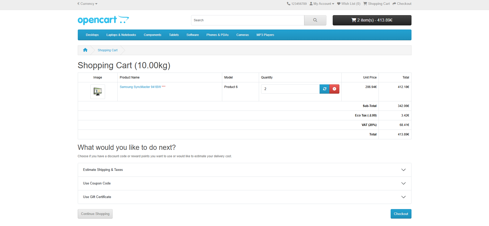

# BUG-001 — Cart subtotal displays incorrect amount after quantity update

**ID:** BUG-001  
**Jira:** OCT-35  
**Date:** 26/04/2026  
**Reported by:** Miguel Guedes  
**Status:** Open  

## Summary
Cart subtotal displays incorrect amount after quantity update.

## Environment
- Browser: Chrome (latest)
- OS: Windows 11
- URL: https://demo.opencart.com

## Severity / Priority
- Severity: Major
- Priority: High

## Steps to Reproduce
1. Add Samsung SyncMaster 941BW to cart
2. Navigate to cart page
3. Update quantity to 2
4. Click Update button

## Expected Result
Sub-Total = Unit Price × Quantity = 206.94 × 2 = 413.88€

## Actual Result
Sub-Total displays 342.06€ which does not match 
the expected calculation.

## Screenshots
